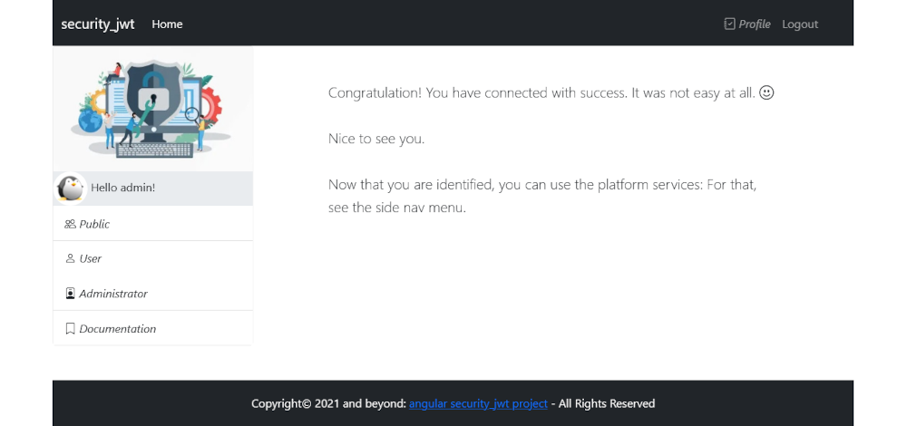
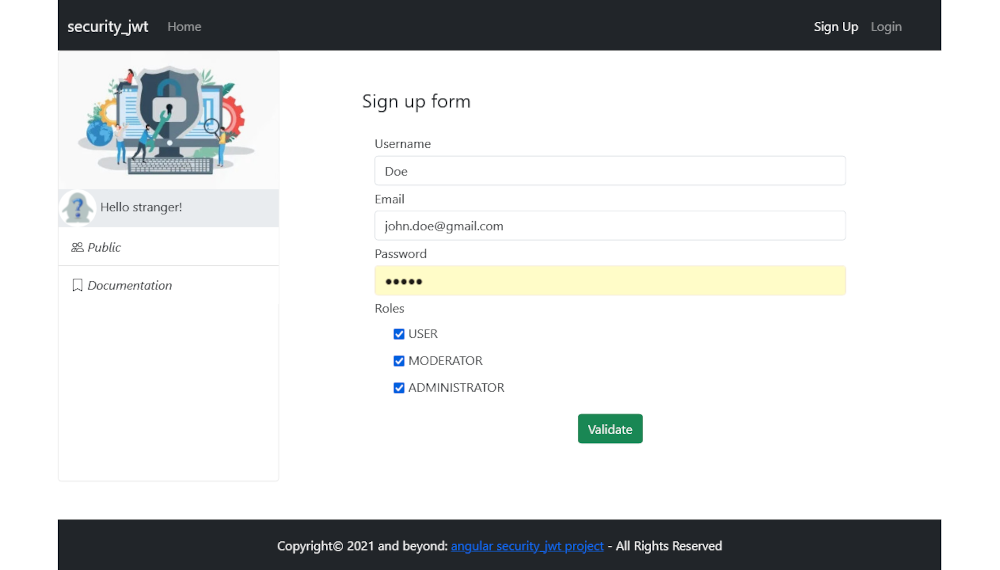
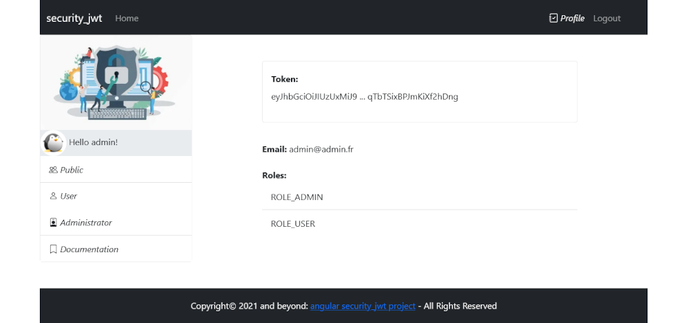
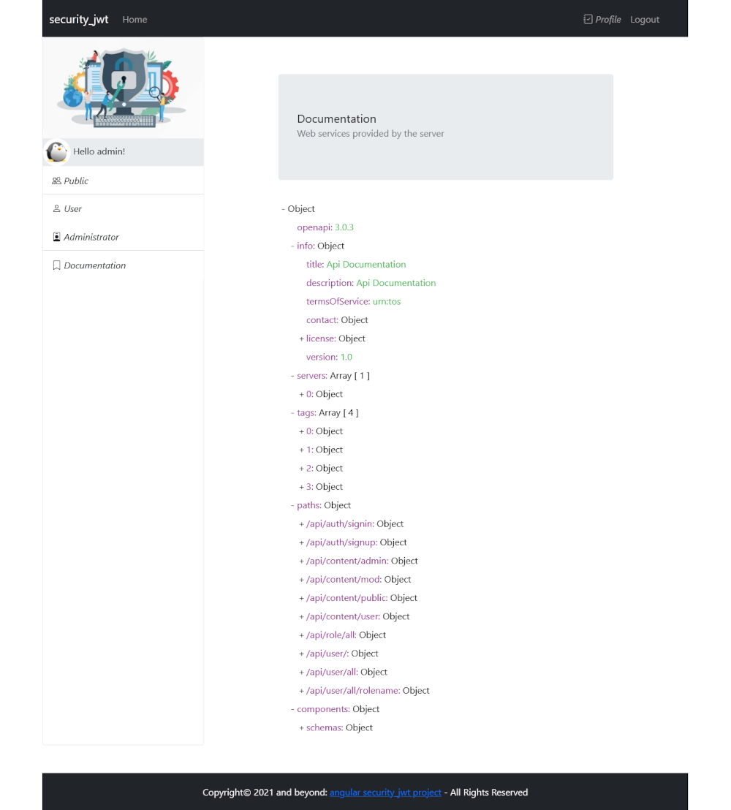

# INTRODUCTION 

You say **FULL STACK DEVELOPMENT**?

You think **FULL STACK DEVELOPMENT**?

You will do **FULL STACK DEVELOPMENT**?

>**Then, this project will help you!**
 
 
# PROJECT OBJECTIVES AND ASSETS 

The project presents simply, but with efficience, how a server provides safe services to a web client.

And as you guessed it, it's a **full stack web project** whose is presented to you here.

So, this project contains two parts :

1. The server or **back** implementation with **JEE-SPRING**
2. The client application or **front** implementation with **ANGULAR**

This project presents too a **professional implementation**.

# BACK-END - SERVER 

The back-end or server implementation is available at this address: 
????

## Features

The server provides services by **Restful Web Services**. 

The web services are available after **authentication** and **autorization**. 

After authentication **JWT token** is generated and sent to the client.

## Implementation

The project implements some **spring** assets as :

- Spring boot
- Spring JPA
- Spring test
- Spring security
- Spring web services
- Spring validation

## Database

The database server used by the project is **postgreSQL**. 

The database server parameters can be changed in the **application.properties** file for a connection to other database.

## Miscelaneous

Some interesting libraries are used as :

- Lombox
- Swagger
- Logger

## Coding

The architecture respects some famous **design patterns** as MVC for example.

The architecture is organized with the following parts :

- Configuration
- Controllers
- Models
- Repositories
- Security management
- Services
- Tests

The code respects the **coding standards and good pratices** accepted by the Java-JEE developper community.

## Documentation 

### API documentation 

When the server is running, the **API documentation** is available at this adress : 

http:// { SERVER_ADRESS : PORT } /api/v3/api-docs

A version of the documentation is also available here :

[API documentation](./doc/api/api-doc.md) 

### Code source documentation 

The **JAVADOC documentation** is available here :

[JAVADOC documentation](./doc/javadoc/allclasses-index.html) 

# FRONT-END - CLIENT 

The front-end or server implementation is available at this address: 
????

## Features

After authentication and identification, the client can do requests to the server.

When a server response is received, the client display the content to the user.

## Implementation

The project implements some **angular** assets as :

- Module
- Component
- Routing
- Guard
- Interceptor
- Pipe
- Model
- Interface
- Service
- Observable
- BehaviorSubject
- Local storage

## Miscelaneous

The main goal of the project is not to do an interface with a lot of professional graphic objects.

Therefore, the user interface uses **bootstrap** for presents a correct **responsive design** application.

## Coding

The architecture respects some famous **design patterns** as MVVM for example.

The architecture is organized with the following parts :

- Modules
- Components
- Models
- Services

The code respects the **coding standards and good pratices** accepted by the Angular developper community.

## Screen shots

### Home page

#### Home page for an user connected

### Register page

### User profile page

## Documentation page

# CONCLUSION 

>Good project for learning how to do professional implementation with JEE-SPRING.
>
>The client application take again the same professional approach with ANGULAR.
>
>For concluding, this project use a lot of good concepts or pratices that it is necessary to know for provide professionnal application.
>
>For more information or a thank you : send a message at <noelmaurice4@gmail.com>.
>
>**Enjoy with this full stack project and see you soon**
>

